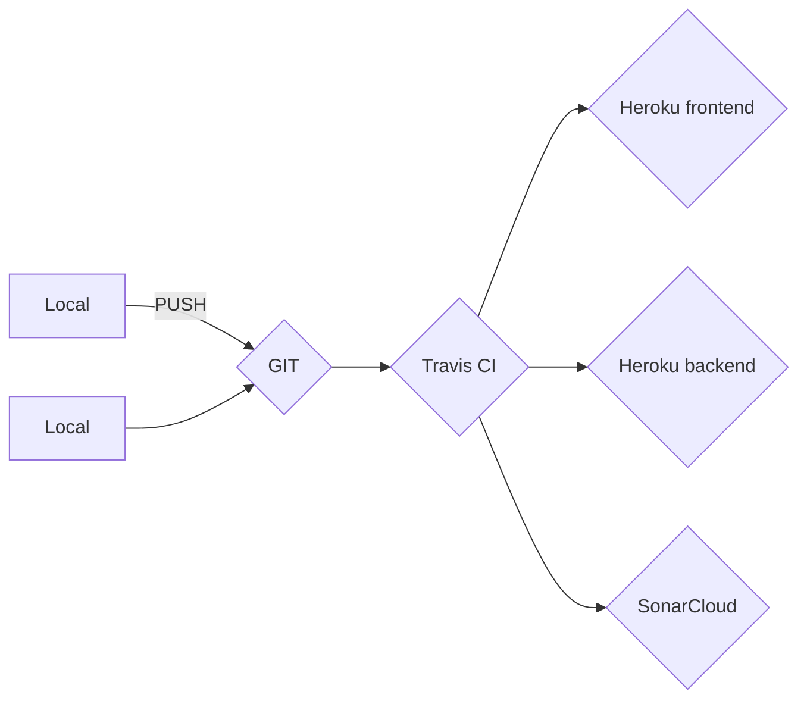

[](https://sonarcloud.io/dashboard?id=milospp_mrs-isa)
[](https://sonarcloud.io/dashboard?id=milospp_mrs-isa)
[](https://sonarcloud.io/dashboard?id=milospp_mrs-isa)

# Pharmacy Project
MRS-ISA Project

# Forked repository
We have forked the repository because we spent all the free credit on Travis CI.

Finally, we have made the pull request from old repository (main) to new repository (main).

Link to the forked repository is https://github.com/isidora-stanic/mrs-isa

# Running a project

Clone this repository:
```
git clone https://github.com/milospp/mrs-isa.git
```

Or clone the new repository:
```
git clone https://github.com/isidora-stanic/mrs-isa.git
```

Run frontend:
```
cd mrs-isa/frontend/pharmacy
npm install --save
npm run serve
```

Run backend (from the root folder for cloned repo):
```
cd mrs-isa/backend
.\mvnw spring-boot:run
```

Frontend runs on local port 3000

Backend runs on local port 8080

http://localhost:3000/


# Demo
https://pharmacy9.herokuapp.com/ 

[backend API url](https://pharmacy9.herokuapp.com/)

> Project is deployed on free Heroku server, and because of that performances are limited.
> After 30min of inactivity server will be automatically shut downed and it will take some time to wake up on the next request

## Team

| 1 |2  | 3 | 4 |
|--|--|--|--|
| Miloš Popović | Milica Đumić | Isidora Stanić | Mladen Vasić |
| SW-24/2018 | SW-27/2018 | SW-16/2018 | SW-28/2018 |


## Deployment
Looks like it's not working here :(


